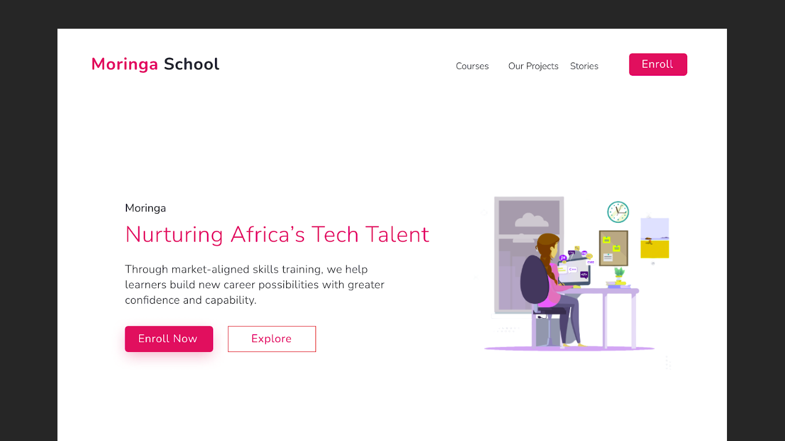

# Moringa landing page
***
## Creator :blush:
Moringa Landing Page was created and is maintained by **Kelvin Njoro**
* [Twitter](https://twitter.com/kelvinprincipal/)
* [Github](https://github.com/principalkelvo/)
* [Facebook](https://facebook.com/principal.kelvin1/)

## Design 

For full design click [image](https://drive.google.com/file/d/1fEotYCYASJfDtQv_x-C2jCKkJ_PVa7w0/view)

## Description

This is a landing page for Moringa school. The main purpose of this respisotory is to share a simple school landing page. This project is done by using HTML and CSS only to create a cool landing page. It is a fully developed light mode for desktop computers

::: warning
**The landing page has dummy text where needed**
:::

### Contains
* A navbar- with school logo
* A hero/header section 
  * with the slogan 
  * and buttons
* A body Sections
  * Stories
  * Moringa Technical Mentors
  * Projects
* A footer section
  * Build with :smiling_face_with_three_hearts:

### Features
> - Static Html page - no fancy hosting needed (Github pages does it for free)
> - Light source code - fast to load
> - Beautiful interface - compatible with all desktops and with a beautiful and pleasant interface.
> - Smooth Scroll - added a back to top scroll btn

*[btn]: button

###  Requirements
* Access to  a computer or any other gadget
* Access to internet

### Setup and installation

To view the website,

+ Click [Here](https://principalkelvo.github.io/school_landing_page/) **or**
+ Copy the link https://principalkelvo.github.io/school_landing_page/ paste to your browser and load it

### Built with
* HTML - which was used to develop the structure off the pages.
* CSS - which was used to style the User Interface.

*[CSS]: Cascading Style Sheet

*[HTML]: HyperText Markdown Language

## Bugs and Issues

Have a bug or issue? Open a new issue here on Github

### Known Bugs
* There are no known bugs

## Image Attribution

Images owned by Moringa school

Free for personal use with attribution

## Credits
* __[Google Fonts](https://fonts.google.com/)__ - Nunito

## License

Use it freely but please do not republish, distribute or sell

Thats it! Simple, clean and smooth!